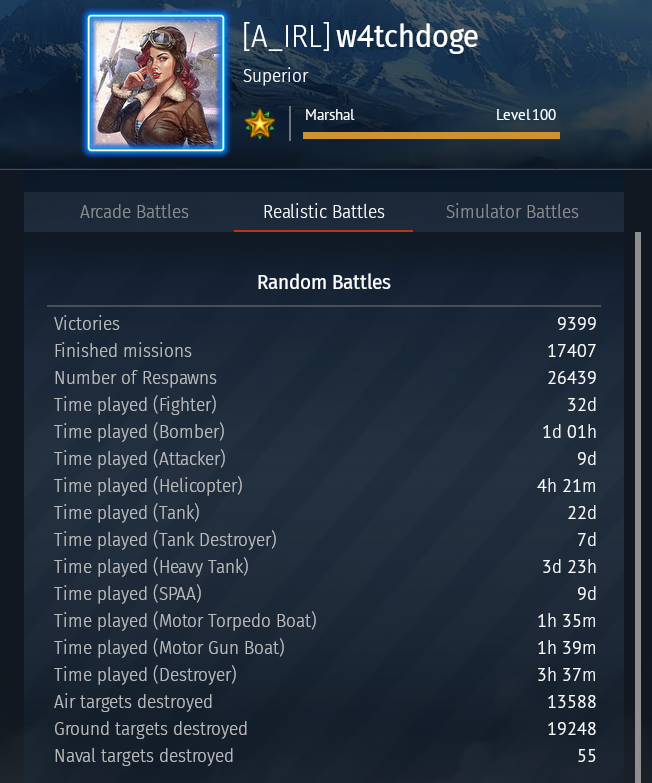

# War Thunder In-Match Playtime Calculator

Calculate how much time you've spent in-match in War Thunder using an input file with your playtimes taken from your statistics page.

For information about the parameters passed to the CLI application please check the help text with the command:
```console
wt-playtime --help
```

## Installation

Installation requires Python >= 3.9, as I have written this with [`pipx`](https://pipx.pypa.io/stable/) in mind.

For `pipx` installation instructions please refer to [the `pipx` homepage](https://pipx.pypa.io/stable/).

### Install From GitHub

```console
pipx install git+https://github.com/w4tchdoge/WT-calcInMatchPlaytime.git
```

### Install From Local Folder

```console
pipx install path/to/this/git/repo
```

## Example Usage

1. View a user's statistics page in-game.

    Example statistics page:

    
    <br />
    <br />

2. Take the `Time Played` entries you are interested in and save them to a `.tsv` or `.csv` file. The entries can be from multiple game modes.

    **N.B.** The example files contain `Time Played` entries from a single game mode.

    <details>
    <summary> Example <code>.tsv</code> file with headers:</summary>

    ```
    Category	Time Played
    Time played (fighter)	32d
    Time played (Bomber)	1d 01h
    Time played (Attacker)	9d
    Time played (Helicopter)	4h 18m
    Time played (Tank)	22d
    Time played (Tank Destroyer)	7d
    Time played (Heavy Tank)	3d 23h
    Time played (SPAA)	8d
    Time played (Motor Torpedo Boat)	1h 35m
    Time played (Motor Gun Boat)	1h 39m
    Time played (Destroyer)	3h 37m
    ```

    </details>

    <details>
    <summary>Example <code>.csv</code> file without headers:</summary>

    ```
    Time played (fighter), 32d
    Time played (Bomber), 1d 01h
    Time played (Attacker), 9d
    Time played (Helicopter), 4h 18m
    Time played (Tank), 22d
    Time played (Tank Destroyer), 7d
    Time played (Heavy Tank), 3d 23h
    Time played (SPAA), 8d
    Time played (Motor Torpedo Boat), 1h 35m
    Time played (Motor Gun Boat), 1h 39m
    Time played (Destroyer), 3h 37m
    ```

    </details>
    <br />

3. Run the CLI application with the `.tsv`/`.csv` file as an input.

    Process input file which contains headers:
    ```console
    wt-playtime -nh -i .\input.tsv
    ```

    Process input file which does not contain headers:
    ```console
    wt-playtime -i .\input.tsv
    ```

    The output of the application will be in the format `{HOURS_PLAYED} hours`.
